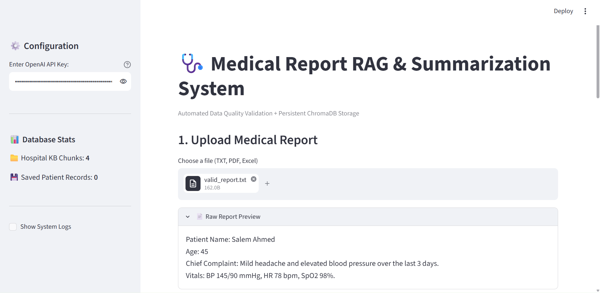
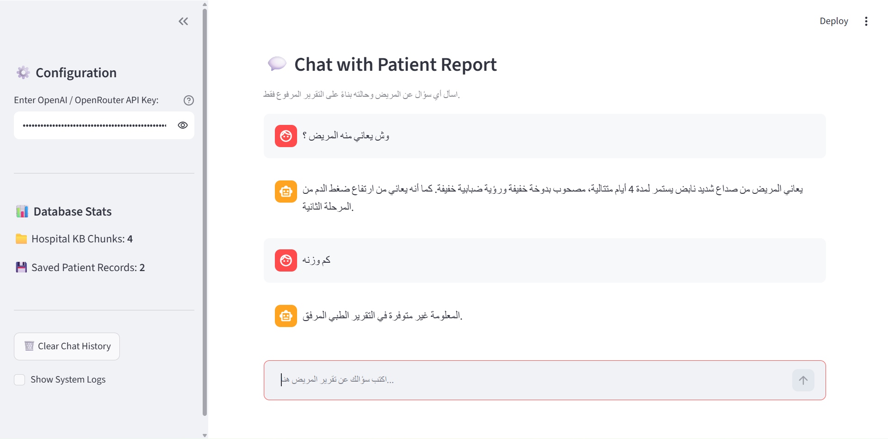
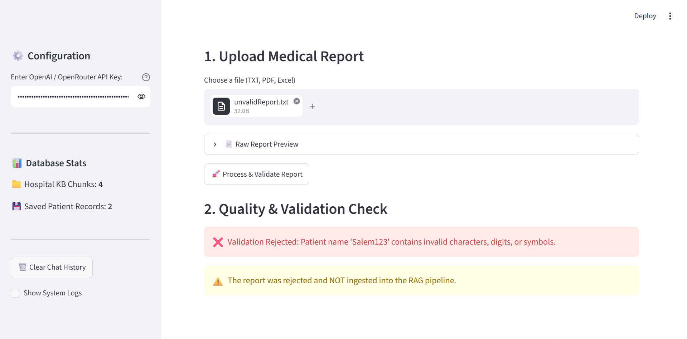
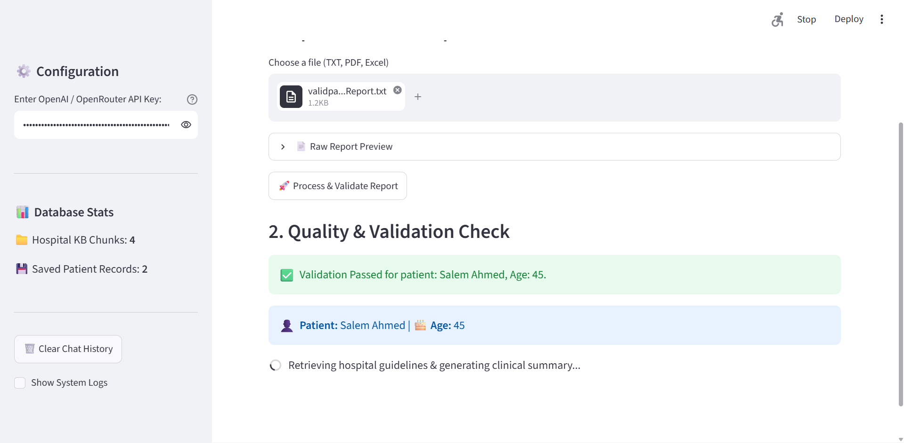
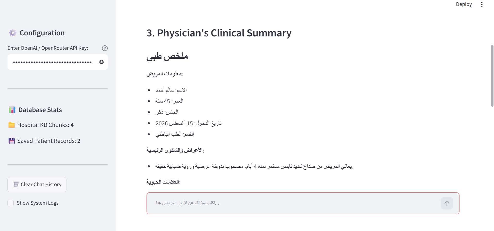

```markdown
# 🩺 Medical Report RAG & Summarization System

An end-to-end AI-powered clinical assistant built with Python. This system processes and validates medical reports, leverages **Retrieval-Augmented Generation (RAG)** with vector storage (**ChromaDB**) to generate guideline-grounded summaries for physicians, and provides an interactive, hallucination-safe clinical chatbot.

> 🎓 **Academic Project Acknowledgment**  
> This project was developed as part of a training course program offered by **[SDAIA Academy](https://github.com/SDAIAAcademy)** (@SDAIAAcademy).

---

## 📌 Key Features

1. **Multi-Format Document Ingestion:**
   - Text extraction from `TXT`, `PDF`, and `Excel` (`.xlsx`, `.xls`) medical files.

2. **Automated Data Quality & Validation Pipeline:**
   - **Patient Name:** Strictly validates string inputs to contain only alphabetic letters (rejects digits and special symbols).
   - **Patient Age:** Ensures age is an integer within a valid human lifespan (0 to 120 years).
   - **Automatic Rejection:** Instantly rejects invalid files, preventing corrupted data from entering the LLM pipeline.

3. **RAG-Grounded Clinical Summarization:**
   - Ingests hospital guidelines and clinical protocol datasets (`hospital_knowledge.txt`).
   - Uses **ChromaDB** vector database to retrieve contextual knowledge for generating structured clinical summaries.

4. **Persistent Vector Storage:**
   - Allows one-click persistent saving of patient reports and generated summaries into a `patient_records` collection in ChromaDB.

5. **Grounded Clinical Chatbot (Hallucination-Safe):**
   - Interactive Q&A strictly constrained to the uploaded patient report.
   - Responds with *"Information not available in the report"* if requested data is missing, guaranteeing zero hallucination.

6. **Audit & Pipeline Logging:**
   - Comprehensive system logging in `system_pipeline.log` for full auditability of validations, summaries, and errors.

7. **Clean Web UI:**
   - Built completely using Streamlit with no HTML required.

---

## 📂 Project Structure

```text
├── app.py                   # Streamlit interactive web interface
├── pipeline.py              # Data extraction, validation, RAG, logging, and ChromaDB logic
├── hospital_knowledge.txt   # Hospital guidelines / clinical knowledge dataset
├── requirements.txt         # Project dependencies
├── system_pipeline.log      # Event audit log file (auto-generated)
└── README.md                # Project documentation

```

## User Interface








## 🚀 Installation & Setup

### 1. Clone the Repository

```bash
git clone [https://github.com/your-username/your-repo-name.git](https://github.com/your-username/your-repo-name.git)
cd your-repo-name

```

### 2. Install Dependencies

```bash
pip install -r requirements.txt

```

### 3. Run the Application

```bash
python -m streamlit run app.py

```

## ⚙️ How to Use

1. **Enter API Key:** Paste your OpenAI or OpenRouter API key in the sidebar configuration.
2. **Upload Report:** Select a medical file (`TXT`, `PDF`, or `Excel`).
3. **Process & Validate:** Click **🚀 Process & Validate Report** to run data quality checks.
4. **View Summary:** Review the generated physician-ready summary.
5. **Save to Database:** Click **💾 Save Record to ChromaDB** to archive the record permanently.
6. **Chat:** Ask specific questions about the patient in the chat interface below.

---

## 📜 Credits & Acknowledgments

Special thanks to **[SDAIA Academy](https://github.com/SDAIAAcademy)** (@SDAIAAcademy) for providing the curriculum and guidance during this AI course.

---
